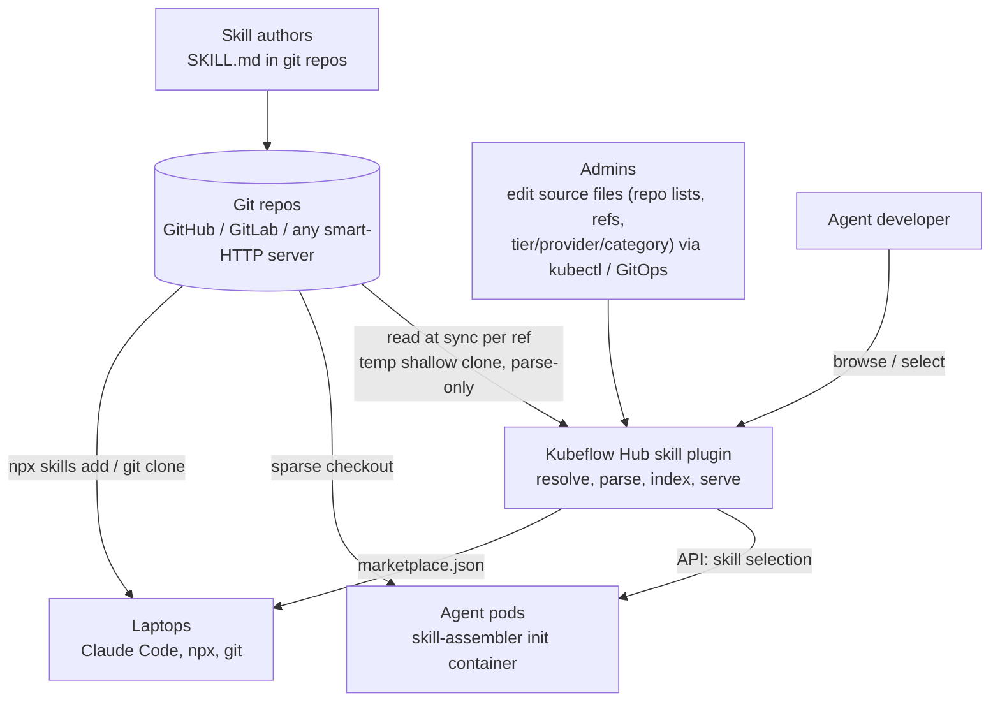
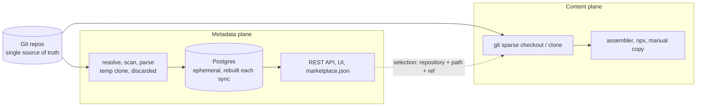
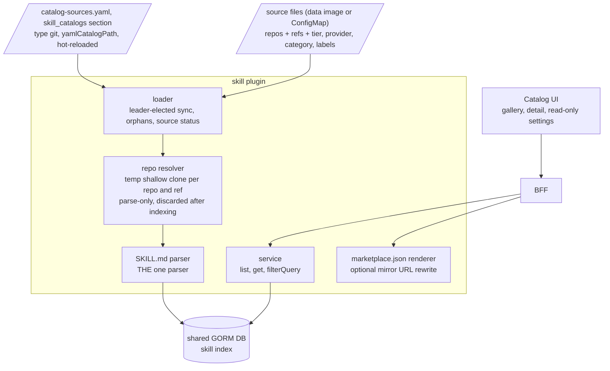
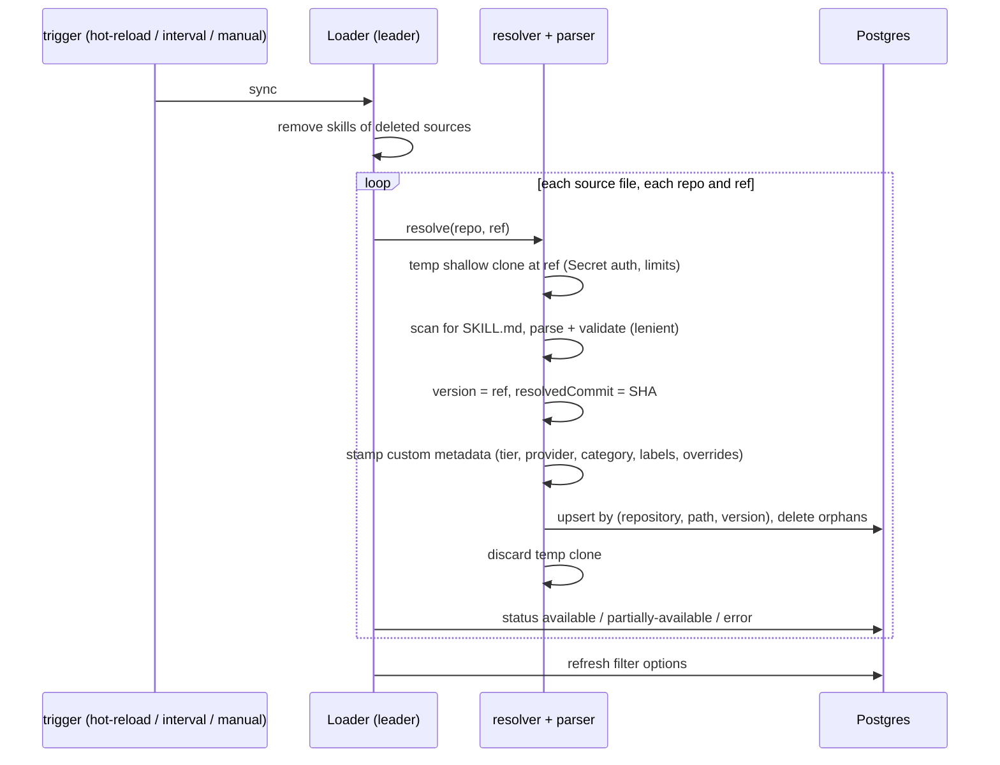
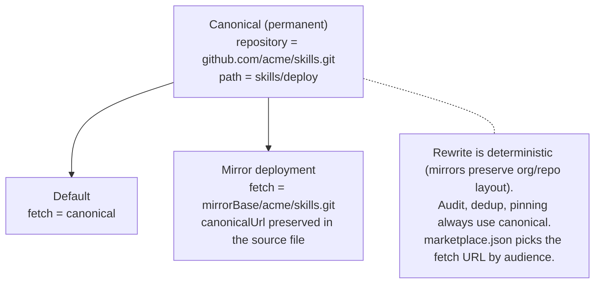
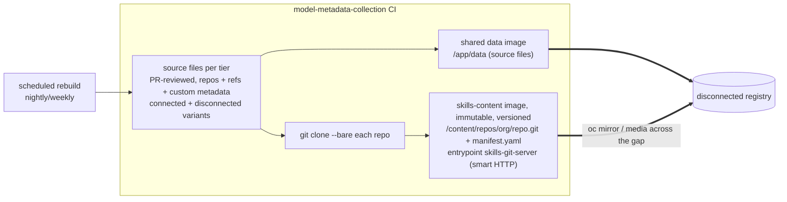
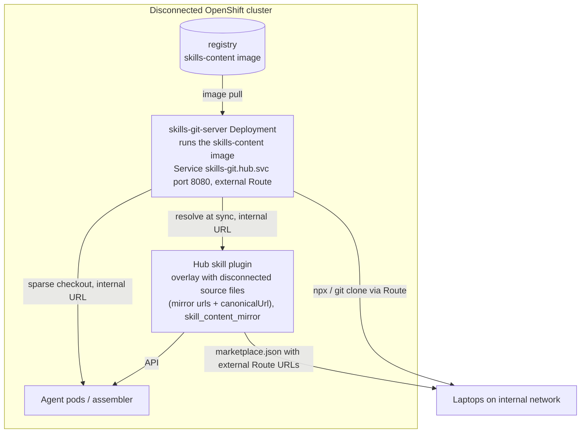

# Skill Catalog - High-Level Architecture

- **Part I - Core (upstream Kubeflow Hub, connected model).** Everything in the Hub KEP; self-sufficient wherever git sources are reachable.
- **Part II - Optional disconnected support.** Default source files + a self-serving skills-content image (built-in smart-HTTP git server), deployed only when the cluster cannot reach the source repos. Adds **zero code** to the Hub plugin: disconnected support is configuration plus one optional Deployment.

**Governing principle:** git repos are the only place skills live; everything else is a view. Postgres is an ephemeral cache rebuilt by reading git (temporary shallow clones for parsing only; repos are never stored); the agent assembler checks skills out of the same repos the catalog reads. One SKILL.md parser exists (in Hub): Hub is the only component needing skill *metadata*; every other consumer takes *content* directly from git.

---

# Part I - Core Architecture 

## 1. System Context

## 2. Two Planes, One Meeting Point

Metadata (browse/choose) and content (obtain/run) travel separately and meet only at the canonical identity `(repository, path)`. Both planes read the same repos, so they can never drift.

## 3. Hub Skill Plugin - Components

A new source type `git`, named per Hub's convention of naming source types for what they read (`yaml`, `hf`). Its configured file lists git repositories, refs, and custom metadata, not pre-parsed skill data.

## 4. Sync Flow - Rebuilding the Ephemeral Index

## 5. Identity - Canonical vs Fetch URL

Internal IDs are not durable (the index is a cache); the canonical identity is the only permanent reference, unchanged even when a deployment reads through a different URL. `version` (the ref) distinguishes entries.

## 6. Custom Metadata - Who Sets Tier / Provider / Category

Custom metadata lives in the source files and is stamped at sync; it is never stored in the wipeable index and never read from repo content. There is no API write path: sources change by editing the mounted files. `trustTier` is simply a label (`platformProvided`, `partnerVerified`, `organizationApproved`, or `communityContributed`) shown as a badge and filterable, with no ordering or special semantics.

| Entry path | Who | Sets |
|---|---|---|
| Platform-shipped source files (PR-reviewed; Part II: authored in m-m-c) | Platform team | All fields |
| Deployment-edited source files (kubectl / GitOps) | Cluster admins | All fields; admin = whoever holds ConfigMap access |
| `skillOverrides` on a repo entry | Either | Per-skill category/labels |
| SKILL.md `metadata` frontmatter | Skill authors | `customProperties` only, never tier/provider |

## 7. Consumers - Three Install Protocols

| Protocol | Input | Notes |
|---|---|---|
| `/plugin marketplace add <catalog-url>` | The catalog's `marketplace.json` | Claude Code + compatible agents; one add = whole curated catalog. Key feature |
| `npx skills add <repo-url>` | A **git repo** URL, never the catalog URL | Upstream repos, or the mirror Route (Part II) |
| Manual | `git clone` + copy | Into the agent's skills dir (`~/.claude/skills/`, `~/.agents/skills/`, ...) |

The skill detail page renders all three with environment-correct, copy-paste-ready URLs.

---

# Part II - Optional Disconnected Support (Self-Serving Skills-Content Image)

> Optional: deploy only when the cluster cannot reach the source repos (air-gapped/disconnected); The air gap changes one thing: both planes need an in-cluster git server. The **skills-content image serves itself**: it carries the bare repo clones and a built-in smart-HTTP git server entrypoint, so one Deployment covers both planes (Hub resolves repos on it, the assembler checks out of it), preserving the no-drift invariant. Hub's only delta is configuration (the disconnected source-file variant + `skill_content_mirror`).

## 9. Content Pipeline

A separate pipeline owns the **default source files from git repos** and builds a **skills-content image** that contains all the different skills repos.

- **Source files** these are same YAML configuration files from Phase I the define metadata and git repo locations about the skills.
- **Bare repo clones + the git server** go in a separate immutable `skills-content` image, pulled only in disconnected deployments. Its entrypoint is `skills-git-server`, a small stdlib-only Go binary that serves `/content/repos` over git's smart HTTP protocol via `git http-backend`. Run it and it is the git server; mount/copy it and it is data.

Clones keep their upstream {org}/{repo} names, so everything lines up by construction: the mirror URL is just the canonical URL with its host swapped (github.com/acme/skills.git → {mirrorBase}/acme/skills.git), and the server serves each repo at that same path (/acme/skills.git → /content/repos/acme/skills.git). No lookup tables anywhere, and the org prefix keeps two repos with the same name from colliding.

## 10. Serving the Mirror - Stateless by Construction

No PVC, no database, no loader Job, no admin credentials: the running image **is** the served content. Content update = roll the Deployment to the new image tag. The server is read-only by construction: anonymous push is disabled in `git http-backend` by default, and the container filesystem is an immutable image layer. CVE surface is UBI-minimal + `git-core` + a stdlib-only Go wrapper; there is no web UI, auth system, or persistent state to attack.

One canonical identity, three URLs by audience: in-cluster consumers use the Service URL, laptops the Route URL, and all records (assembly manifest, audit) keep the canonical upstream URL, comparable with connected deployments. Smart HTTP fully supports the operations the system needs: shallow clones, blobless/partial clones, sparse checkout, npx.

*Note:* because the Hub plugin only sees URLs, any git hosting reachable from the cluster (an internal GitLab, Gitea, etc.) can serve as the mirror instead; the self-serving image is simply the zero-state default. Trade-off accepted: no repo-browsing web UI (the catalog UI covers skill browsing) and no push path (the mirror is read-only by design).

---

## Design Invariants

| Invariant | Part | Consequence |
|---|---|---|
| Git is the only durable store of content and source of metadata | I | Postgres droppable/rebuildable anytime; repos never stored in Hub |
| One parser (Hub), fed by source files | I | Spec changes implemented once; metadata refreshes from repos at every sync |
| Canonical identity `(repository, path)` + ref-based versions | I | Audit/pinning comparable across rebuilds, deployments, environments |
| Custom metadata = source files; no API write path | I | Labels are exactly as trustworthy as ConfigMap RBAC |
| Catalog never writes to sources | I | One-way, source-authoritative |
| Assembler is harness-agnostic (layout config) | I | New harnesses need a layout entry, not a delivery system |
| Disconnected support = the self-serving content image + configuration, zero plugin code | II | Upstream carries no deployment concerns; the gap is crossed by an immutable image that is also the server |
